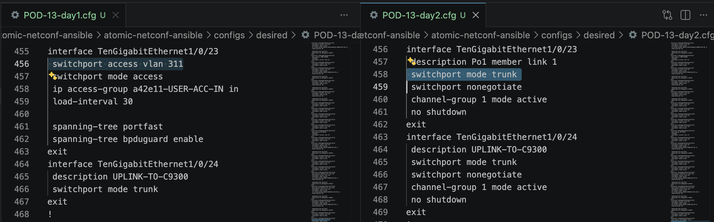

# Atomic NETCONF Ansible Project

This repository contains the workshop assets for modernizing network management using atomic configuration replace with Cisco IOS XE.

## At a Glance: How It Works

The workflow uses NETCONF with candidate datastore and atomic commit behavior.

1. Stage desired config in candidate datastore.
2. Generate a diff between candidate and running.
3. Commit atomically so changes are all-or-nothing.
4. Save running config to startup after successful commit.

Dry-run mode performs stage and diff only, then discards candidate changes.

### Step 0: Lab Environment Setup

Your instructor will provide a pod number, management IP, and credentials.

1. Open Visual Studio Code.
2. Select the Remote button in the lower-left corner (two arrows facing each other).
3. Choose Connect to Host.
4. SSH to your pod in this format:

```bash
ssh auto@<YOUR_POD_IP>
```

5. Navigate to the project folder and verify tooling:

```bash
cd iosxe-atomic-netconf-ansible/atomic-netconf-ansible
ansible --version
ansible-galaxy collection install -r requirements.yml
```


## Step 1: Introduce The Files

The main implementation is in the [atomic-netconf-ansible](atomic-netconf-ansible) folder.

Key files and folders:
- [atomic-netconf-ansible/README-tomic-config-ansible.md](atomic-netconf-ansible/README-tomic-config-ansible.md): Detailed framework usage and workflow guidance.
- [atomic-netconf-ansible/playbooks](atomic-netconf-ansible/playbooks): Ansible playbooks for precheck, baseline capture, push, and diff preview.
- [atomic-netconf-ansible/inventory](atomic-netconf-ansible/inventory): Inventory and host configuration.
- [atomic-netconf-ansible/configs](atomic-netconf-ansible/configs): Baseline, desired, and backup configuration files.
- [atomic-netconf-ansible/docs/quickstart.md](atomic-netconf-ansible/docs/quickstart.md): Quick-start walkthrough.

## Step 2: Project File Structure

```text
.
├── LICENSE
├── README.md
└── atomic-netconf-ansible
    ├── AGENT.md
    ├── README.md
    ├── ansible.cfg
    ├── requirements.yml
    ├── playbooks
    │   ├── 01_precheck.yml
    │   ├── 02_baseline_capture.yml
    │   ├── 03_atomic_push.yml
    │   ├── 04_diff_preview.yml
    │   ├── 05_baseline_capture_cli.yml
    │   ├── 06_atomic_push_cli.yml
    │   └── 07_diff_preview_cli.yml
    ├── inventory
    │   └── hosts.yml
    ├── configs
    │   ├── backups
    │   ├── baseline
    │   └── desired
    └── docs
        └── quickstart.md
```

For full framework details, start with [atomic-netconf-ansible/README-tomic-config-ansible.md](atomic-netconf-ansible/README-tomic-config-ansible.md).

## Step 3: End-to-End Workflow

### High-Level Flow

```text
[1] Precheck
    ansible-playbook ... 01_precheck.yml
        |
        v
[2] Capture baseline + desired
    ansible-playbook ... 05_baseline_capture_cli.yml
        |
        v
[3] Choose target config file
    POD-##-day0.cfg / POD-##-day1.cfg / POD-##-day2.cfg
        |
        v
[4] Swap desired symlink
    ./set-c9300x-target.sh <target>
    (c9300x-lab.cfg now points to selected day file)
        |
        v
[5] Atomic apply
    ./run_full_replace_ansible_playbook.sh
        |
        v
      +-------------------------------+
      | [6] Validation result         |
      +-------------------------------+
        | pass                     | fail
        v                          v
 [7] Verify hostname/interfaces   [7] Fix config line from error
        |                          |
        +----------- re-run -------+

When pass is stable:
  -> swap to next target (for example day2)
  -> apply + validate again
  -> finally swap back to day0 and re-apply
```

This flow shows the full learning cycle: prepare, swap day files in/out, apply atomically, validate, iterate to the next day file, then restore day0.

1. **Run precheck preview** Run a precheck to confirm NETCONF connectivity and required device capabilities before making any configuration changes.

   ```bash
   ansible-playbook -i inventory/hosts.yml playbooks/01_precheck.yml
   ```

2. **Capture baseline files** Capture the current running configuration and create baseline and desired files that will be used for the rest of the workflow.

   ```bash
   ansible-playbook -i inventory/hosts.yml playbooks/05_baseline_capture_cli.yml
   ```

   Creates two files per device:
   - `configs/baseline/c9300x-lab/baseline.cfg` - Reference copy.
   - `configs/desired/c9300x-lab.cfg` - Your working copy.

3. **Open and compare the baseline and desired files** Compare both files listed above to confirm your starting point and understand exactly what will change when updates are introduced. Note: baseline and desired files are currently identical.

4. **Review `POD-##-day1.cfg`** Review the day1 target configuration so you can map intended changes into the desired file with full context. Note, ## will be replaced with your pod number.

5. **Edit desired config for day1** Update the desired configuration to include the day1 changes you want to apply atomically.

6. **Apply day1 config atomically** Run a live atomic push that stages candidate changes, shows the diff, commits, and saves the resulting configuration.

   ```bash
    # First use: inspect the helper script so you understand what it runs.
    cat run_full_replace_ansible_playbook.sh

    # Then run the helper script.
    ./run_full_replace_ansible_playbook.sh
   ```

   The live push log includes:
   - BEFORE: Full running config captured via `get-modelled-config-clis` before staging.
   - DIFF: Unified diff showing exactly what changes.
   - AFTER: Full running config captured via `get-modelled-config-clis` after commit.
   - Both before/after configs saved to `configs/backups/<hostname>/` as `pre_atomic_*.cfg` and `post_atomic_*.cfg`.

7. **Observe the expected apply error** Treat this failure as expected guardrail behavior: atomic workflows prevent partial application and keep the network in a known-good state.

8. **Fix the invalid CLI line** Remove the unsupported line from the desired config and save so the next transaction can pass validation.

9. **Re-run day1 atomic push** Re-run the same atomic push command after fixing the invalid line.

   ```bash
    ./run_full_replace_ansible_playbook.sh
   ```

10. **Validate successful day1 apply** Confirm both command success and device state so you verify not only transport success, but also correct operational outcome.

11. **Check day1 port-channel state** Check interface state to verify whether the port-channel came up as expected after day1 is applied.

    ```bash
    show ip interface brief | include Port-channel1
    ```

    The result should be:

    ```text
    Port-channel1          unassigned      YES unset  down                  down
    ```

    This is valid configuration, but the port channel is still down and requires a day2 adjustment.

12. **Prepare and apply day2 port-channel changes** Review and apply the day2 deltas so the port-channel and member interfaces are configured for operational uplink behavior.

13. **Update desired config to day2** Use the helper script [`set-c9300x-target.sh`](atomic-netconf-ansible/set-c9300x-target.sh) and the reference guide [`docs/set-c9300x-target.md`](atomic-netconf-ansible/docs/set-c9300x-target.md) to move from day1 desired content to day2 desired content in a repeatable way.

    

14. **Re-run atomic push for day2** Apply day2 using the same atomic push workflow so the change remains all-or-nothing.

    ```bash
    ./run_full_replace_ansible_playbook.sh
    ```

15. **Validate successful day2 apply** Validate that the day2 hostname and interface operational state both match expected results.

    ```bash
    show ip interface brief | include Port-channel1
    ```

    The result should be:

    ```text
    Port-channel1          unassigned      YES unset  up                  up
    ```

16. **Restore original day0 state** Roll back to your original baseline to complete the full lifecycle exercise from baseline to updates and back again.

17. **Re-run atomic push for day0** Push the day0 desired state with the same atomic mechanism used throughout the lab.

    ```bash
    ./run_full_replace_ansible_playbook.sh
    ```

Success! You have completed the steps needed to understand how to apply many different configurations to your device using atomic operations.

## Helper Script Reference

Use [`set-c9300x-target.sh`](atomic-netconf-ansible/set-c9300x-target.sh) to switch which desired config file is linked to `configs/desired/c9300x-lab.cfg`.

This lets your playbooks keep using `c9300x-lab.cfg` while you move between day0/day1/day2 target configs.

Common usage:

```bash
# one-time
chmod +x atomic-netconf-ansible/set-c9300x-target.sh

# list available desired configs
./atomic-netconf-ansible/set-c9300x-target.sh --list

# point to day1 or day2
./atomic-netconf-ansible/set-c9300x-target.sh POD-13-day1.cfg
./atomic-netconf-ansible/set-c9300x-target.sh POD-13-day2.cfg
```

Full usage documentation is in [`atomic-netconf-ansible/docs/set-c9300x-target.md`](atomic-netconf-ansible/docs/set-c9300x-target.md).


## Reference

- [Cisco IOS XE 26.1 Programmability Guide](https://www.cisco.com/c/en/us/td/docs/ios-xml/ios/prog/configuration/26x/26x-programmability-cg.html)
- YANG model: `Cisco-IOS-XE-cli-rpc` (revision 2026-02-01, v1.3.0)
- Detailed walkthrough: [atomic-netconf-ansible/docs/quickstart.md](atomic-netconf-ansible/docs/quickstart.md)
- Jinja pod generation workflow: [atomic-netconf-ansible/docs/jinja-pod-workflow.md](atomic-netconf-ansible/docs/jinja-pod-workflow.md)

## TODOs


- Step 5 note: create a helper script to update desired config with a command.
- Step 7 note: add an image showing the expected apply error.
- Step 13 note: create script to update desired config to day2 file.
- Step 16 note: provide day0 re-apply script details.
